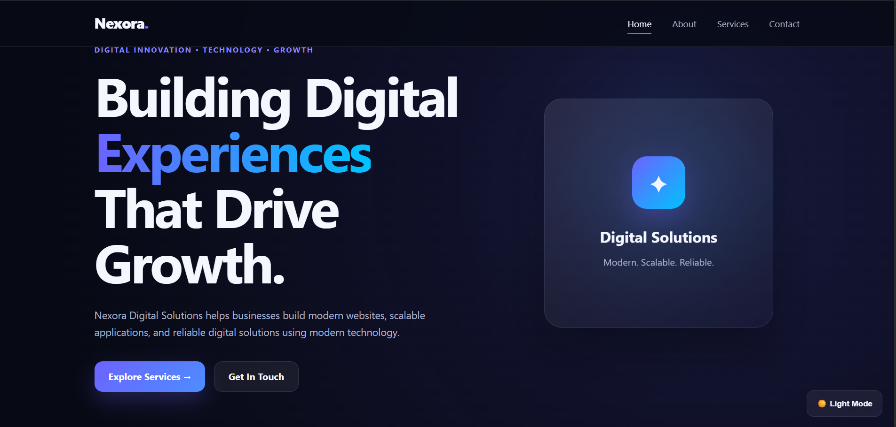
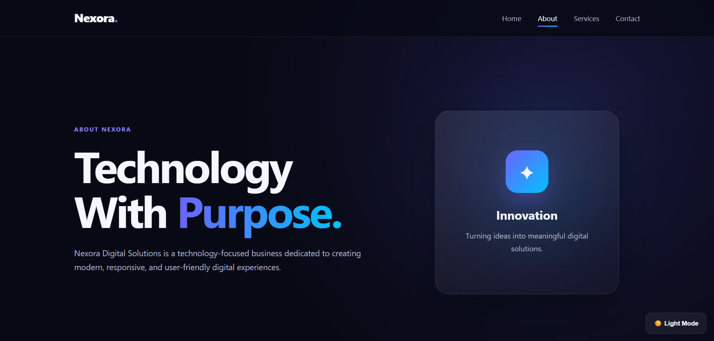
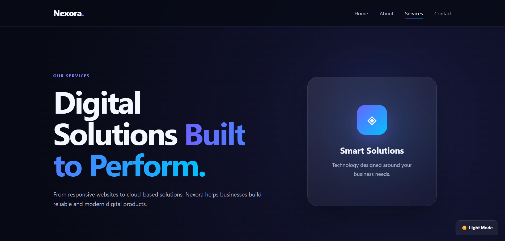
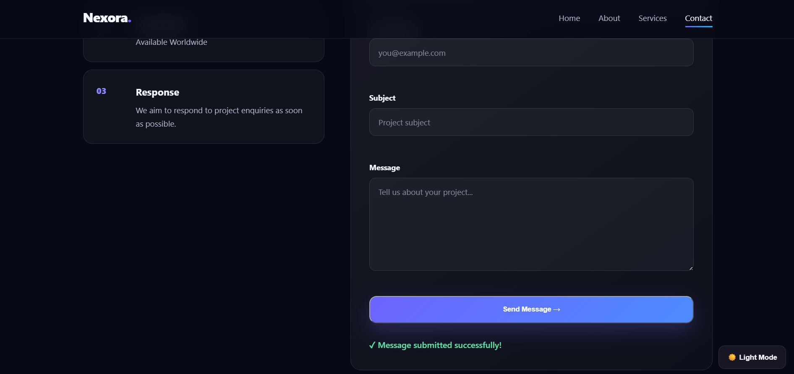
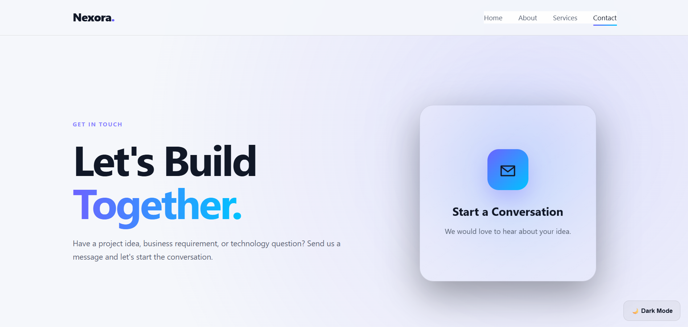
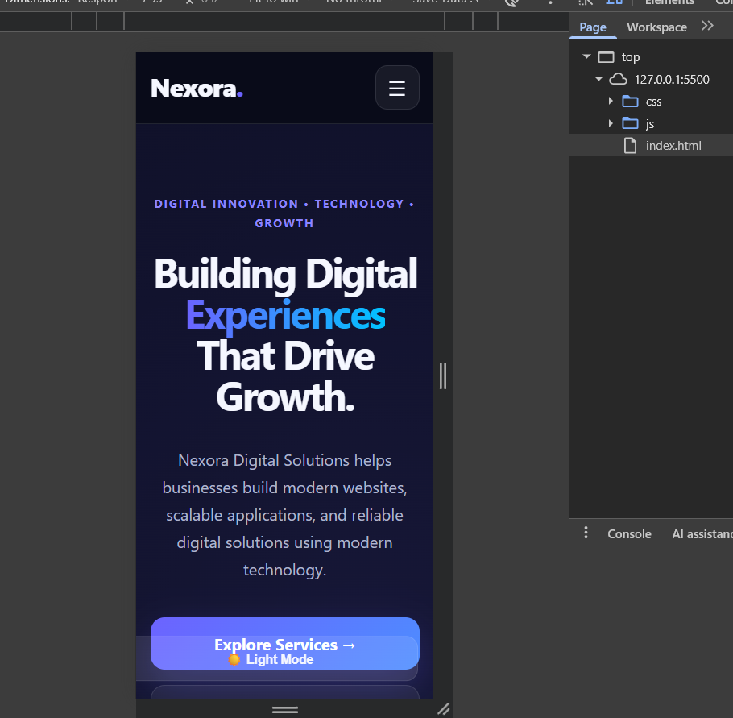

# Nexora Digital Solutions

A responsive professional services website developed as part of the **Week 4 – Complete Web Development Project**.

---

## 1. Project Overview

**Nexora Digital Solutions** is a modern, responsive professional services website designed to present digital technology services to potential clients.

The website provides information about services including:

- Web Development
- Web Applications
- Cloud Solutions
- UI/UX Design
- API Integration
- Website Maintenance

The project demonstrates the implementation of a complete multi-page website using **HTML5, CSS3, and JavaScript**.

---

## 2. Project Objectives

The main objectives of this project are:

- To develop a complete multi-page business website.
- To create a responsive layout for desktop, tablet, and mobile devices.
- To implement reusable and organized CSS styling.
- To add JavaScript-based interactive functionality.
- To implement client-side contact form validation.
- To provide responsive navigation.
- To implement Dark/Light mode.
- To create scroll-based animations.
- To maintain a clean and organized project structure.
- To document the development and deployment process.

---

## 3. Features Implemented

### Website Pages

The project contains four main pages:

1. **Home Page** – `index.html`
2. **About Page** – `about.html`
3. **Services Page** – `services.html`
4. **Contact Page** – `contact.html`

### Main Features

- Responsive multi-page layout
- Professional business website design
- Responsive navigation menu
- Mobile navigation menu
- Dark/Light mode
- Theme persistence using LocalStorage
- Contact form
- Client-side form validation
- Real-time form error messages
- Form success message
- Scroll-based animations
- CSS Grid layout
- Flexbox layout
- CSS custom properties
- Responsive media queries
- Accessibility-focused interface
- Modern glassmorphism-inspired design
- Consistent buttons, cards, spacing, and typography

---

## 4. Technologies Used

### Frontend

- HTML5
- CSS3
- JavaScript

### CSS Technologies

- CSS Variables
- Flexbox
- CSS Grid
- Media Queries
- CSS Transitions
- CSS Animations

### JavaScript Technologies

- DOM Manipulation
- Event Listeners
- LocalStorage API
- Intersection Observer API
- Client-side Form Validation

---

## 5. Project Structure

```text
nexora-digital-week4/
│
├── index.html
├── about.html
├── services.html
├── contact.html
├── README.md
│
├── css/
│   └── style.css
│
├── js/
│   └── script.js
│
├── images/
│   ├── Home.png
│   ├── Light_Dark_mode.png
│   ├── about.png
│   ├── contact.png
│   ├── mobile.png
│   └── service.png
│
└── screenshots/
```

---

## 6. Code Structure Explanation

### `index.html`

The main landing page of the website.

It contains:

- Header
- Navigation
- Hero section
- Services overview
- Benefits/features
- Call-to-action section
- Footer

---

### `about.html`

The About page provides information about Nexora Digital Solutions.

It includes:

- Company introduction
- Company approach
- Values
- Innovation
- Quality
- User-focused development

---

### `services.html`

The Services page presents the digital services provided by Nexora Digital Solutions.

Services include:

- Web Development
- Web Applications
- Cloud Solutions
- UI/UX Design
- API Integration
- Website Maintenance

The page also presents the development process:

1. Understand
2. Design
3. Develop
4. Test & Launch

---

### `contact.html`

The Contact page allows users to submit an enquiry.

The form contains:

- Name
- Email
- Subject
- Message

JavaScript validates the submitted information before displaying the success message.

---

### `css/style.css`

The main stylesheet responsible for:

- Layout
- Typography
- Colors
- Responsive design
- Navigation styling
- Cards
- Buttons
- Forms
- Animations
- Dark/Light mode
- Mobile layouts

CSS custom properties are used to maintain consistency throughout the website.

---

### `js/script.js`

The JavaScript file provides interactive functionality.

It implements:

- Mobile navigation
- Dark/Light mode
- LocalStorage theme persistence
- Contact form validation
- Real-time form validation
- Success messages
- Scroll animations
- DOM event handling

---

### `images/`

Contains visual assets and screenshots used for project documentation.

---

## 7. Responsive Design

The website is designed to provide a consistent experience across different screen sizes.

The responsive layout supports:

- Desktop
- Laptop
- Tablet
- Mobile devices

Responsive behavior is implemented using:

- CSS Media Queries
- Flexbox
- CSS Grid
- Flexible widths
- Responsive spacing
- Mobile navigation

---

## 8. Contact Form Validation

The contact form uses JavaScript for client-side validation.

### Name Validation

The name must contain at least two characters.

### Email Validation

The email address is checked using an email validation pattern.

### Subject Validation

The subject must contain at least three characters.

### Message Validation

The message must contain at least ten characters.

### Validation Features

- Required field validation
- Invalid email detection
- Minimum length validation
- Real-time error messages
- Error clearing when valid input is entered
- Success message after valid submission

---

## 9. Dark/Light Mode

The website includes a Dark/Light mode feature.

JavaScript changes the theme by adding or removing the `light-mode` class from the page.

The selected theme is stored using:

```text
LocalStorage
```

This allows the selected theme to remain available when the user reloads the website.

---

## 10. JavaScript Interactivity

The website uses JavaScript to provide interactive functionality.

### Mobile Navigation

A menu button allows users to open and close the navigation menu on smaller screens.

### Theme Toggle

Users can switch between Dark and Light themes.

### Form Validation

The contact form checks user input before submission.

### Scroll Animation

The Intersection Observer API detects when elements enter the viewport and applies animation effects.

---

## 11. Screenshots

### Home Page



---

### About Page



---

### Services Page



---

### Contact Page



---

### Dark/Light Mode



---

### Mobile Responsive Design



---

## 12. Design Decisions

The website follows a modern professional technology-company design.

### Visual Design

The interface uses:

- Dark background
- Gradient accents
- Rounded cards
- Glassmorphism-inspired components
- Clear typography
- Consistent spacing
- Interactive hover effects

### Color System

CSS custom properties are used to manage the color system.

This makes it easier to maintain consistent colors throughout the website and simplifies future theme changes.

### Responsive Layout

Flexbox and CSS Grid were used to create flexible layouts that adapt to different screen sizes.

### User Experience

The design focuses on:

- Simple navigation
- Clear content hierarchy
- Readable typography
- Visible call-to-action buttons
- Responsive interaction
- Form feedback

---

## 13. Technical Requirements

| Requirement | Implementation |
|---|---|
| Minimum 3 HTML Pages | Home, About, Services, and Contact pages |
| Responsive Design | CSS Media Queries, Flexbox, and CSS Grid |
| Navigation | Navigation links across all website pages |
| Mobile Navigation | JavaScript-powered mobile menu |
| Contact Form | Name, Email, Subject, and Message fields |
| Form Validation | JavaScript client-side validation |
| Real-Time Validation | Input event listeners |
| Dark/Light Mode | JavaScript theme switching |
| Theme Persistence | LocalStorage |
| Animations | CSS transitions and Intersection Observer |
| Image Documentation | Screenshots stored in the images folder |
| Accessibility | Semantic HTML, labels, focus states, and readable interface |
| Code Organization | Separate HTML, CSS, JavaScript, and image directories |
| Documentation | Complete README documentation |
| Deployment | GitHub Pages |

---

## 14. Setup and Installation

No additional framework or package installation is required.

### Step 1 – Clone the Repository

```bash
git clone https://github.com/Rohityadav039/nexora-digital-week4.git
```

### Step 2 – Open the Project

```bash
cd nexora-digital-week4
```

### Step 3 – Open in VS Code

```bash
code .
```

### Step 4 – Run the Website

Open:

```text
index.html
```

in a web browser.

Alternatively, the project can be opened using the **Live Server** extension in Visual Studio Code.

---

## 15. Testing

The following features were tested during development:

### Navigation Testing

- Home page navigation
- About page navigation
- Services page navigation
- Contact page navigation
- Navigation links across pages

### Responsive Testing

The website was checked on:

- Desktop
- Laptop
- Tablet
- Mobile screen sizes

### Form Testing

Tested scenarios include:

- Empty fields
- Invalid email
- Short name
- Short subject
- Short message
- Valid form submission

### Theme Testing

Tested:

- Dark mode
- Light mode
- Theme switching
- Theme persistence after page reload

### Interaction Testing

Tested:

- Mobile menu
- Buttons
- Navigation links
- Form interactions
- Scroll animations

---

## 16. Deployment

The website can be deployed for free using **GitHub Pages**.

### GitHub Repository

https://github.com/Rohityadav039/nexora-digital-week4

### Deployment Steps

1. Push the project to GitHub.
2. Open the GitHub repository.
3. Open **Settings**.
4. Select **Pages** from the sidebar.
5. Under **Build and deployment**, select:
   - Source: `Deploy from a branch`
   - Branch: `main`
   - Folder: `/ (root)`
6. Click **Save**.
7. GitHub Pages will build and publish the website.
8. The generated GitHub Pages URL can then be used to access the live website.

---

## 17. Git Version Control

Git was used to manage the project source code.

Important Git commands used during development:

```bash
git init
git add .
git commit -m "Complete Week 4 Nexora Digital Solutions website"
git push -u origin main
```

Additional documentation and screenshots were committed using:

```bash
git add .
git commit -m "Add documentation and project screenshots"
git push
```

---

## 18. Learning Outcomes

Through this project, the following skills were practiced:

- Multi-page website development
- Semantic HTML5
- Responsive CSS
- CSS Grid
- Flexbox
- JavaScript DOM manipulation
- Event handling
- Form validation
- LocalStorage
- Intersection Observer API
- Responsive navigation
- Git and GitHub
- Project documentation
- Website deployment

---

## 19. Future Improvements

Possible future improvements include:

- Backend integration for the contact form
- Database integration
- Real email notifications
- Authentication system
- CMS integration
- Advanced animations
- SEO optimization
- Performance optimization
- Additional accessibility improvements
- Custom domain deployment

---

## 20. Author

**Rohit Yadav**

MCA Student  
Central University of Karnataka

---

## 21. Project Information

**Project:** Nexora Digital Solutions  
**Internship Task:** Week 4 – Complete Web Development Project  
**Category:** Professional Services Website  
**Frontend:** HTML5, CSS3, JavaScript  
**Repository:** `nexora-digital-week4`

---

## License

This project was created for educational and internship purposes.